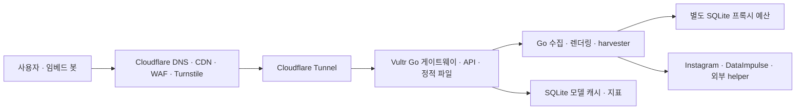

# OGInstagram Cloudflare → VPS 이전 계획서

작성·수정일: 2026-10-05 · 대상: 현재 OGInstagram 작업 디렉터리

**서비스를 중단한 뒤 최종 Vultr 구조를 한 번에 배포하고, 검증을 마친 후 다시 연다. Cloudflare DNS·CDN·WAF·Turnstile은 유지하며, Vultr High Frequency `vhf-1c-1gb` / New Jersey(`ewr`) / Ubuntu 24.04 LTS 한 대를 사용한다. 월요금은 $6 세전, 한국 개인 VAT 10% 적용 시 예상 $6.60이며 자동백업은 선택하지 않는 기본안이다.**

서비스 중단을 허용하는 재배포이므로, 기존 Worker와 새 서버를 연결하는 임시 구조·카나리·트래픽 분할·구 버전 호환성·Cloudflare 앱으로의 복귀 절차는 구현하지 않는다. 프론트엔드와 서버를 함께 변경하고 함께 배포할 수 있다.

이 문서는 최종 구조의 실행 계획과 현재 구현 상태를 함께 기록한다. 로컬 작업 디렉터리에는 Go 게이트웨이·홈/정적 파일·미리보기·미디어·SQLite 캐시/예산/지표, 새 Docker 이미지와 Compose 운영 구성을 구현했다. Worker 런타임과 Wrangler 배포 의존성은 제거했다. 실제 서비스 중단·Vultr 서버 생성·운영 배포·DNS 변경은 실행하지 않았다. 공개 6개 호스트와 실제 Vultr egress·최대 부하 검증은 배포 단계에 남아 있다. 코드와 공식 문서를 확인했으며 현재 운영 계정의 배포·청구액은 조회하지 않았다.

## 1. 이전 범위와 완료 기준

| 항목 | 최종 위치 | 처리 |
|---|---|---|
| 도메인·DNS·공개 HTTPS | Cloudflare | 기존 도메인과 6개 호스트 사용 |
| CDN·WAF·DDoS 보호·Turnstile | Cloudflare | 보호 정책 유지, 새 origin용 캐시 정책 설정 |
| Go 수집·렌더링 서버 | Vultr | 현재 서버를 바탕으로 게이트웨이 기능 통합 |
| Node·Obscura harvester | Vultr | 기존 이미지에 포함된 실행 구성 사용 |
| 홈페이지·정적 파일·미리보기·미디어·관리 API | Vultr | Worker 기능을 Go로 이식, 웹과 함께 배포 |
| 모델 캐시·프록시 예산·애플리케이션 지표 | Vultr | SQLite 영속 저장과 메모리 캐시 사용 |
| Workers·Containers·KV·Durable Objects·Analytics Engine | 종료 | Cloudflare 애플리케이션 런타임 의존성 제거 |

새 배포는 다음을 새로 시작한다.

- 모델 캐시는 비운 상태로 시작한다. KV 내보내기·점진적 읽기·캐시 이관 API를 만들지 않는다.
- 지표는 새 배포 시점부터 수집한다. AE 과거 기록의 병합이나 기존 지표 JSON 형식 호환을 요구하지 않는다.
- `/offload` 서명 키와 URL 규격은 새 배포에 맞게 정할 수 있다. 구 서명 URL 지원과 구 키의 14일 유지 기간을 이전 조건으로 두지 않는다.
- API·헤더·설정·DB 스키마는 웹과 Go를 함께 수정한다. 기능이 정상 동작하는지를 검증한다.
- DataImpulse 프록시 자격 증명·외부 helper 자격 증명·Turnstile 설정은 실제 사용할 값으로 주입한다.

프록시 일일 예산은 유료 사용량 제한이므로 캐시처럼 무조건 초기화하지 않는다. 중단 후 신규 UTC 일자에 시작하거나, 당일 잔여량을 알 수 없으면 해당 일자는 소진 처리한다. 구 서버와 신규 서버를 동시에 운영하지 않는다.

완료 기준은 공개 6개 호스트의 주요 기능·인증·캐시·프록시 예산이 새 구조에서 정상 동작하고, Cloudflare 애플리케이션 리소스 없이 재시작·배포·복구할 수 있는 상태다.

## 2. 서버 사양과 비용

### 2.1 Lite~Basic급 기본안

| 서비스 | CPU | RAM | 디스크 |
|---|---:|---:|---:|
| Cloudflare Container Lite | 1/16 vCPU | 256 MiB | 2 GB |
| Cloudflare Container Basic | 1/4 vCPU | 1 GiB | 4 GB |
| 비교: Vultr Regular `vc2-1c-1gb` | 공유 1 vCPU | 1,024 MB | 25 GB SSD |
| **선택: Vultr High Frequency `vhf-1c-1gb`** | **공유 1 vCPU** | **1,024 MB** | **32 GB NVMe** |
| 비교: Vultr High Performance AMD `vhp-1c-1gb-amd` | 공유 1 vCPU | 1,024 MB | 25 GB NVMe |

Cloudflare Basic의 4 GB는 디스크 용량이다. Vultr 기본 서버는 1 GB RAM으로 정한다. High Frequency는 일반형보다 $1 높은 월요금에 3 GHz 초과 CPU와 NVMe를 제공하며 사용자의 선호에 따라 선택했다. 이 앱에서 High Performance AMD보다 빠른지는 실측하지 않았다. 공유 CPU 수치는 플랫폼 사이의 동일한 실제 성능을 보장하지 않는다. [Cloudflare 공식 사양](https://developers.cloudflare.com/containers/platform/limits/), [Vultr 공식 계획 API](https://api.vultr.com/v2/plans), [Vultr 상품 구분](https://docs.vultr.com/products/compute/instances/cloud-compute/provisioning)

지역은 **New Jersey(`ewr`)**로 정한다. 미국 DataImpulse 프록시를 사용하는 수집 경로를 기준으로 한 선택이며, 직접 Instagram 조회와 helper 성공률은 실제 서버에서 확인한다. 2026-10-05 공식 API에서 `vhf-1c-1gb`의 `ewr` 재고를 확인했다. 실행 시 재고는 다시 확인한다. [지역 API](https://api.vultr.com/v2/regions), [ewr 가용 계획 API](https://api.vultr.com/v2/regions/ewr/availability)

1 GB에는 OS·Docker·`cloudflared` 메모리도 포함된다. Compose는 앱 1 CPU·512 MiB와 네트워크 connector인 `cloudflared` 128 MiB를 할당한다. Tunnel은 연결 경로이며 애플리케이션·DB·캐시 런타임은 Vultr에만 둔다. harvester·이미지 변환을 포함한 최대 사용량을 이 한도에서 검증한다. CI 또는 개발 환경에서 이미지를 빌드하고 운영 VM은 이미지를 내려받아 실행한다.

서버 추가·자동 확장·유료 추가 옵션은 구성하지 않는다. 별도 스테이징 서버·Redis·관리형 DB·Kubernetes·로드밸런서는 기본 구성에 넣지 않는다. 같은 Vultr 서버를 공개 전 검증하고 그대로 운영한다.

### 2.2 비용 예산

| 후보 | 월 기본요금 세전 | 자동백업 선택 시 세전 | 월 포함 전송량 |
|---|---:|---:|---:|
| Regular 1 GB | $5.00 | $6.00 | 1,024 GB |
| **선택: High Frequency 1 GB** | **$6.00** | **$7.20** | **1,024 GB** |
| High Performance AMD 1 GB | $6.00 | $7.20 | 2,048 GB |

기본은 provider 자동백업 미선택이며 **$6 세전·한국 개인 VAT 10% 적용 시 예상 $6.60/월**이다. 자동백업은 별도 선택 시 +20%로 $7.20 세전·예상 $7.92 세후다. 2026-10-05 공식 API 기준이며 카드 환전·전송량 초과·별도 외부 백업 보관비는 제외한다. [Vultr 공식 계획 API](https://api.vultr.com/v2/plans), [자동백업 정책](https://docs.vultr.com/vps-automatic-backups), [한국 VAT](https://docs.vultr.com/support/platform/billing/does-vultr-collect-vat-or-sales-tax)

계정은 사용자가 직접 만들며 신용카드의 $0 deposit 옵션을 이용하면 최초 충전 없이 연결할 수 있다. 일시적인 카드 승인 보류가 발생할 수 있고 다른 결제 수단은 deposit이 필요할 수 있다. 서버는 시간 단위로 과금하고 익월 1일에 전월 사용액을 청구한다. 정지한 instance도 삭제 전까지 과금한다. [가입 조건](https://docs.vultr.com/platform/create-an-account), [청구 방식](https://docs.vultr.com/support/platform/billing/how-am-i-billed-for-my-servers)

운영 예산은 `Vultr VM + 적용 세금 + 초과 전송량 + 유지하는 Cloudflare 서비스 + DataImpulse + 외부 helper 비용`으로 계산한다. 백업 옵션을 선택하면 그 비용을 더한다. 구 앱 리소스를 종료하기 전까지 발생한 Cloudflare 청구액도 포함한다. 현재 청구서를 확인하기 전에는 이전으로 절약되는 금액을 확정하지 않는다. [후보 가격과 계정·지역 차이](vps-price-comparison-2026-10-05.md)

Vultr는 outbound 전송량을 집계하고 초과요금은 $0.01/GB다. 따라서 Vultr→Cloudflare 응답도 원본 전송량으로 계산한다. CDN 캐시가 원본 요청을 줄일 수 있지만 Tunnel 자체가 전송비를 없애지는 않는다. 이는 공식 과금 규칙에 따른 해석이다. **DataImpulse 월 100 GB 제한은 Vultr 전송량과 별개다.** [전송량 계산](https://docs.vultr.com/support/platform/billing/how-is-bandwidth-usage-calculated), [초과요금](https://docs.vultr.com/support/platform/billing/what-is-the-bandwidth-overage-rate)

## 3. 최종 구조

Go 한 애플리케이션에 게이트웨이와 기존 핸들러를 통합하고 Docker Compose로 앱·Tunnel·영속 볼륨을 관리한다. 공개 HTTPS는 Cloudflare에서 처리하고, 앱 포트는 loopback 또는 비공개 컨테이너 네트워크에서만 접근하게 한다. 공개 호스트에는 Access 로그인 정책을 적용하지 않는다. [Tunnel 라우팅](https://developers.cloudflare.com/tunnel/concepts/routing/), [origin 보호](https://developers.cloudflare.com/fundamentals/security/protect-your-origin-server/)

**이전 착수 전 구조:** 당시 Dockerfile에는 Go·Node·Obscura만 들어 있었고 `web/dist`와 Worker 기능은 포함되지 않았다. Go는 Containers 전용 `CACHE_URL`·`BUDGET_URL`을 요구했다. 이 설명은 이전 전 기준이며 현재 실행 구조가 아니다. 최종 Dockerfile은 웹 빌드·Go 게이트웨이·FFmpeg를 포함하고, Go는 로컬 SQLite를 직접 사용한다.

이전의 `http://og.worker/cache`·`/budget` Containers 전용 연결은 제거했다. **Worker↔Vultr 연결, 외부 캐시/예산 API, Access 서비스 토큰, 임시 전환 플래그는 구현하지 않았다.** 최종 앱은 로컬 저장소를 직접 사용한다.

## 4. 구현 작업

아래 파일은 현재 작업 디렉터리에 구현된 최종 구조다. Cloudflare 운영 리소스의 종료는 실제 배포 단계에서 별도로 수행한다.

| 작업 | 최종 실행 파일 | 구현 |
|---|---|---|
| 게이트웨이·경로·미리보기·관리 API | `server/gateway.go` | Host·URL·모드·봇/사람 분기, 요청 제한·Siteverify·관리자 인증 |
| 홈페이지·정적 파일 | `server/home.go`, `tools/build-home.mjs` | 언어·CSP·site key·보안 헤더, 8개 홈 template 포함 |
| 모델 캐시 | `server/cache.go`, `server/storage.go` | 메모리와 SQLite, TTL·용량 제한 |
| 프록시 예산 | `server/proxy.go`, `server/storage.go` | 영속 SQLite 트랜잭션으로 lease 발급, 장애·복구 시 비용 보호 |
| 미디어·서명 | `server/media.go`, `server/offload_signer.go` | Go 서명 검증·미디어 proxy, FFmpeg WebP/AVIF 변환 |
| 지표·상태 페이지 | `server/storage.go`, `web/src/status.tsx` | 로컬 수집·집계와 웹 상태 화면 |
| 시작·운영 설정 | `server/main.go`, `server/config.go`, `Dockerfile`, `compose.yaml` | production 설정 검증·healthcheck·SQLite 백업·secrets·영속 볼륨 |
| 개발·검사·배포 | `package.json`, `tools/dev.mjs`, `tools/deploy.sh`, `tools/backup.sh` | Worker 없이 개발·검사·중단 후 배포·백업 |
| Cloudflare 앱 의존성 정리 | `package.json`, `pnpm-lock.yaml`, `tsconfig.json` | Wrangler/Containers 패키지 및 Worker 소스·타입·전용 배포 설정 제거 |

### 4.1 요청 처리와 보안

Go 게이트웨이가 공개 요청을 직접 받고 `User-Agent`·`Origin`·`Sec-Fetch-Site`·`Cookie`·`Accept`·`Content-Type`·메서드·본문을 사용한다. 게이트웨이와 핸들러는 같은 프로세스 안에서 함수 인자와 응답 필드로 정보를 주고받으며, Worker↔Container 시절의 내부 요청 헤더는 쓰지 않는다. 핸들러의 공개 origin은 허용 목록으로 검증한 Host에서 만든다. 공개 Host를 허용 목록으로 검증하고 `CF-Connecting-IP`는 신뢰된 Tunnel 경로에서만 사용한다.

`POST /api/embed`의 WAF Managed Challenge와 Turnstile pre-clearance를 유지한다. `cf_clearance`의 존재만으로 인증 성공을 판정하지 않는다. WAF를 통과한 요청만 origin에 도달하게 하고 cookie hash는 요청 제한 키로만 사용한다. token 제공 시 Siteverify 성공·action·hostname을 확인하고 실패 시 거부한다. API와 웹을 함께 배포하므로 새 요청/응답 형식을 사용할 수 있다. [Clearance 동작](https://developers.cloudflare.com/cloudflare-challenges/concepts/clearance/), [Turnstile 서버 검증](https://developers.cloudflare.com/turnstile/get-started/server-side-validation/)

기존의 4 KB JSON 본문 제한·same-origin 확인·clearance별 8회/분 제한은 시작 정책으로 사용한다. 관리자 API에는 별도 관리자 인증을 둔다. secret은 이미지·Git·로그에 넣지 않는다.

### 4.2 캐시와 서명

새 모델 캐시는 비워서 시작한다. 기존 메모리 캐시·single-flight·성공 결과별 저장 정책을 참고하고, SQLite에 TTL과 용량 상한을 둔다. 새 기능에 맞게 내부 캐시 키와 스키마를 바꿀 수 있다. 재오픈 후 캐시 miss가 많아질 수 있으므로 조회 동시성과 프록시 예산을 적용한다.

새 서명 키를 배포하고 새 `/offload` 링크는 서명 검증 후 로컬 캐시를 조회한다. 캐시가 따뜻해도 미서명·변조·만료 요청은 거부한다. 구 URL을 유지하기 위한 변환 계층과 구 키 보존은 구현 범위에서 제외한다.

Workers Caching과 일반 Cloudflare CDN은 설정 방식이 다르므로 CDN 규칙을 새 구조에 맞게 구성한다. [Workers Caching 구성](https://developers.cloudflare.com/workers/cache/configuration/), [일반 CDN 기본 동작](https://developers.cloudflare.com/cache/concepts/default-cache-behavior/)

| 경로 | 초기 Cloudflare 캐시 정책 |
|---|---|
| 해시가 붙은 JS·CSS·공개 정적 자산 | 정상 CDN 캐시 |
| 언어·쿠키·CSP nonce가 반영되는 홈페이지 | bypass |
| `/api/embed`, 관리자 API | bypass / `no-store` |
| `/offload/*` | **bypass: Go가 요청마다 서명 검증** |
| 봇/사람·`Accept`에 따라 다른 임베드 응답 | bypass, origin의 모델/변환 이미지 캐시 사용 |
| 상태 API | 초기에는 bypass, 로컬 지표 집계 응답 |

브라우저 캐시 TTL도 남은 서명 수명을 넘지 않게 제한한다. 임베드 HTML의 추가 CDN 캐싱은 새 구조의 호스트·모드·콘텐츠 협상 분리를 검증한 뒤 선택할 수 있다. 이는 이전 완료 조건이 아니다.

### 4.3 프록시 예산

다음 비용 제한을 새 서버에서 구현한다.

- 월 **100,000,000,000 bytes**를 UTC 월 일수로 나눈 일일 한도.
- 프록시 송신·수신 바이트 합계, **1 MiB lease** 단위 사전 할당.
- UTC 일자별 bucket, 미사용량 이월 없음.
- SQLite의 동기 디스크 commit 완료 후 lease 반환. 저장소 오류 시 프록시 조회 중단.
- 예산 DB는 모델/지표 DB와 분리하고 영속 볼륨에 저장.

**첫 초기화는 구 앱을 완전히 중지한 뒤 새 UTC 일자에 수행하는 것을 기본으로 한다.** UTC 00:00은 한국 시간 09:00이다. 당일 재오픈하면서 구 앱의 사용량을 확실히 알 수 없으면 그 일자의 한도를 소진 처리하고 다음 bucket부터 허용한다. DO 상태 내보내기·공유 카운터·역방향 병합 기능을 새로 만들지 않는다.

실제 외부 검증도 새 SQLite 예산을 사용하며, 검증 후 재오픈한다고 카운터를 다시 0으로 만들지 않는다. 오래된 백업을 복원해 당일 사용량을 증명하지 못하는 경우도 해당 일자를 소진 처리한다.

### 4.4 미디어·지표·자원 제한

현재 `cf.image`의 96/720px 리사이즈·AVIF/WebP 변환은 일반 CDN만 남겨서 구현되지 않는다. Go 이미지 처리 또는 제한된 변환 프로세스로 옮긴다. 1 GB VM에서 이미지 픽셀 수·응답 크기·변환 동시성을 제한하고, 입력 URL과 매 redirect의 CDN 호스트를 검증한다. 직접 미디어 모드는 원본 CDN redirect를 사용해 불필요한 VM 전송을 줄인다.

상태 페이지는 새 앱의 지표를 수집해 표시한다. API 형식은 웹과 함께 바꿀 수 있다. 수집 성공·제한·실패, 캐시 계층, 지연을 구분하고 percentile 집계를 올바르게 구현한다. 제한된 로컬 이벤트/집계, JSON 로그와 로그 회전으로 시작한다.

원본 수집 48개·동적 요청 256개 상한과 4초 응답 타임아웃을 사용한다. 여러 요청이 공유하는 수집 작업은 최대 10초까지 이어져 느린 성공도 캐시에 남긴다. Worker가 담당하던 **전체 동적 요청 제한은 Go 게이트웨이로 옮긴다(256개).** 수집 semaphore만으로 캐시 대기 요청까지 제한할 수는 없다. 초과 시 `503`·`Retry-After`로 응답하고 미디어 변환·harvester 자원 사용도 제한한다.

## 5. 실행 순서

**서비스 중단 → 최종 앱 구현·빌드 → Vultr 배포 → 공개 전 검증 → 도메인 연결 → 재오픈 → 구 리소스 정리** 순서로 진행한다. 구현을 미리 끝내면 중단 기간을 줄일 수 있지만, 무중단이나 특정 중단 시간 목표를 두지 않는다. 중단 후 구현에 착수하면 개발·검증 기간도 중단 기간에 포함된다.

| 순서 | 작업 | 완료 조건 |
|---|---|---|
| 1. 서비스 중단 | Cloudflare 점검 응답 설정, 기존 응답 캐시 제공 중단, 기존 Container·백그라운드 작업 정지 | 구 앱 요청 및 유료 프록시 사용이 중지됨 |
| 2. 최종 앱 구현 | Go 게이트웨이·웹·미디어·SQLite·지표 통합, Cloudflare 앱 전용 연결 제거 | 최종 이미지와 설정 준비 |
| 3. Vultr 배포 | 1 GB VM, 비공개 앱 포트, Compose, Tunnel, secrets, 영속 볼륨 | 공개를 막은 상태에서 앱·저장소·health 정상 |
| 4. 검증 | 관리 경로의 기능/보안/부하/재시작 검증, 제한된 외부 표본 확인 | 재오픈 기준 충족 |
| 5. 도메인 연결 | Worker Custom Domain 해제, 6개 호스트를 Tunnel로 연결, WAF·CDN 규칙 적용 | 새 origin만 요청을 처리하고 점검 상태 유지 |
| 6. 재오픈 | 공개 경로 최종 확인 후 점검 응답 해제 | 주요 기능과 프록시 예산 정상 |
| 7. 구 리소스 정리 | Worker·Container·DO·KV·AE 및 사용하지 않는 secrets·배포 설정 정리 | Cloudflare 앱 의존성·불필요 과금 제거 |

이전 초기 계획의 개발자 1명 기준 구현·배포·검증 추정은 **5~8 작업일**이었다. 현재 로컬 구현은 완료했으며 남은 실제 운영 배포·외부 검증 일정은 계정 설정과 수집 결과에 따라 정한다. 별도 중간 배포 일정·7일 구 시스템 병행 운영·카나리 관찰 기간은 두지 않는다.

공개 6개 호스트는 `oginstagram.com`, `www.oginstagram.com`, `d.oginstagram.com`, `www.d.oginstagram.com`, `g.oginstagram.com`, `www.g.oginstagram.com`이다. `BASE_URL=https://oginstagram.com`과 공개 Host를 사용하는 URL 생성은 새 구조에서 확인한다.

공개 전에는 관리 경로로 검증한다. 실제 WAF·Turnstile·임베드 봇 검증에 공개 접근이 필요한 경우 검증용 호스트 또는 제한된 점검 해제 시간에 확인한다. 기존 서비스와 새 서비스를 병행하지 않는다. 새 앱에 문제가 있으면 점검 상태를 유지하거나 다시 적용하고 수정·재배포한다.

## 6. 재오픈 기준

구 버전과의 완전 동일성 대신 **새 배포의 기능·보안·자원 안정성**을 검증한다.

| 항목 | 검증 |
|---|---|
| 주요 기능 | 게시물·릴스·캐러셀·프로필·스토리·언어·6개 호스트·직접/갤러리 모드·ActivityPub/WebFinger |
| 실제 임베드 | Discord·Telegram의 새 링크 미리보기와 봇/사람 분기 |
| 새 서명 URL | 정상 발급·사용, 미서명·변조·만료 거부, 캐시 hit에서도 인증 수행 |
| preview 보안 | WAF challenge·Turnstile 검증·요청 제한·cross-origin·과대 body 거부 |
| origin 보호 | 공개 IP/포트 직접 접근 차단, 신뢰하지 않는 peer·Host 거부, 관리 API 인증 |
| 캐시 | 모델 TTL·만료 CDN URL 재조회·호스트/모드 분리·purge 정상 |
| 예산 | 재시작·UTC 경계·저장소 장애·오래된 백업 복구에도 유료 사용 한도 증가 없음 |
| 자원 | 1 GB에서 OOM 없음, 최대 부하와 harvester/변환 동시 실행 검증 |
| 운영 | VM 재부팅 후 자동 시작, health/ready, Tunnel 연결, 로그 회전, 백업 복원 |

초기 자원 기준은 지속 RAM 80% 미만, CPU 15분 평균 70% 미만, disk 70% 미만으로 제안한다. 기존 운영 수치는 참고할 수 있으나 상대 성능 수치나 과거 지표 보존을 재오픈의 필수 조건으로 두지 않는다. 실제 요청 timeout과 수집 성공 여부를 함께 확인한다.

`/healthz`는 프로세스 생존, `/readyz`는 필수 설정과 저장소 준비를 확인한다. healthcheck가 Instagram을 매번 호출하지 않게 한다. 부하 검증은 로컬 fixture를 우선 사용하고 실제 외부 조회는 새 예산 안에서 제한한다.

검사 스크립트도 최종 구조로 바꾼다. 웹 lint·TypeScript 검사·Go 테스트와 필요한 경로/인증/예산 검증을 유지하고, 제거한 Worker의 Wrangler 타입 생성·Worker 전용 테스트를 필수 검사에 남겨두지 않는다.

## 7. 배포·백업·장애 대응

이미지 digest와 설정 버전을 기록하고 SQLite를 영속 볼륨에 둔다. Compose 재시작 정책·로그 회전·디스크 사용 상한을 설정한다. 구 Cloudflare 앱이나 구 스키마와의 호환성은 구현하지 않는다.

provider 자동백업은 기본 미선택이다. 앱의 `--backup` 명령이 SQLite `VACUUM INTO`로 일관된 DB snapshot을 만들며, 완료된 백업을 암호화해 VM 외부에 보관하고 복구를 검증한다. 실행 중 DB 파일만 복사하지 않는다. 유료 자동백업을 나중에 선택해도 앱의 일관된 외부 백업을 대체하지 않는다. [SQLite VACUUM INTO](https://www.sqlite.org/lang_vacuum.html), [Vultr 자동백업 정책](https://docs.vultr.com/vps-automatic-backups)

예산 DB의 당일 기록이 불확실한 복원은 당일 프록시 한도를 소진 처리한다. 모델 캐시와 과거 지표는 재생성·새 관측 시작이 가능하다. 재오픈 이후의 복구는 새 Vultr 이미지·설정·DB 백업을 기준으로 한다.

오류가 발견되면 점검 응답으로 서비스를 중단하고 새 앱을 수정·재배포한다. DNS를 구 Worker로 되돌리는 이중 운영 절차, 카나리 비율 조정, 구 DO로의 예산 역이관은 만들지 않는다. 재오픈 직후 지표·로그·자원 사용을 확인하되 관찰 기간을 이유로 구 런타임을 계속 가동하지 않는다.

## 8. 착수 시 확인할 사항

1. `vhf-1c-1gb` / `ewr` 재고와 최종 결제액. 기본 서버 예산은 자동백업 미선택 $6 세전·한국 VAT 적용 시 예상 $6.60/월이다.
2. 이미지 빌드/저장소, secrets 주입, 영속 볼륨, 외부 백업 보관처.
3. 현재 WAF·Redirect·캐시 규칙과 Worker Custom Domain 연결 목록, 점검 응답 설정 방법.
4. 서비스 중단과 재오픈 담당자, 첫 프록시 예산 bucket의 UTC 일자.
5. 실제 DataImpulse/helper 수집 성공, 1 GB VM 최대 메모리, 주요 임베드 결과.

## 9. 확인 근거

- [Compose 운영 설정](../compose.yaml), [Docker 이미지](../Dockerfile), [Vultr 배포·복구 가이드](vultr-deployment.md), [운영·보안 설명](../README.md)
- [Go 게이트웨이](../server/gateway.go), [홈·정적 파일](../server/home.go), [미디어 처리](../server/media.go), [SQLite 캐시·예산·지표](../server/storage.go), [Go 시작 조건](../server/main.go), [Go 설정·자원 제한](../server/config.go)
- 9월 비용·사용량 자료와 구조·성능 보고서는 로컬 전용 `output/`에 있으며 저장소에 포함하지 않는다. 현재 운영 실측치로 간주하지 않음.

제품 사양·요금·동작의 공식 근거는 각 절에 연결했다. 확인일은 2026-10-05이며 실행 시 요금·재고·실제 설정을 재확인한다.
